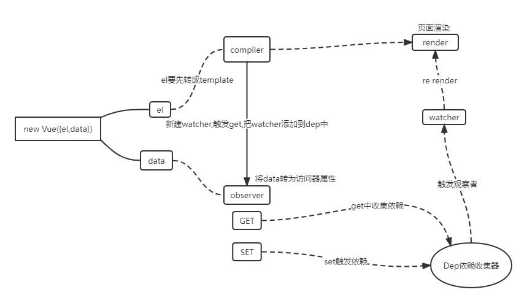

黄宝俊 南京大学 软件工程 大二

实现了一个简单的MVVM框架，实现了数据单向绑定，通过数据劫持和发布订阅模式实现数据的双向绑定。

思路整理

通过Object.defineProperty()来实现对属性的劫持，达到监听数据的目的。

1、实现一个数据监听器Observer,能够对数据对象的所有属性进行监听，如有变动可拿到最新值并通知订阅者

2、实现了一个指令解析器Compiler,对每个元素节点的指令进行扫描和解析，根据指令模板替换数据，以及绑定相应的更新函数

3、实现一个Watcher,作为连接Observer和Compiler的桥梁，能够订阅并收到每个属性变动的通知，执行指令绑定的相应回调函数，从而更新视图

4、MVVM入口函数（在这里以Vue入口函数形式呈现），整合以上三者。

详细设计

index.js

入口函数，转存数据，_proxyData和_proxyMethods进行数据和函数的代理，new Observer先进行数据劫持，new Compiler再进行模板编译

observer.js

进行数据的劫持，walk遍历对象完成所有数据的劫持，defineReactive动态设置响应式数据，监听data的数据获取以及更新。当数据被获取时，调用dep收集watcher。当数据被修改时，调用dep内watcher的notify方法，通知更新。

compiler.js

nodeToFragment把原始的dom转换为文档片段，ignorable忽略哪些节点不添加到文档片段，compiler进行模板编译，其中compilerElementNode编译元素节点，在这里实现了v-text和v-model，compilerMethods编译函数，在这里实现了@；compilerTextNode编译文本节点，使用parseTextExp把text字符串转换为表达式。对节点均创建相应的watcher类

watcher.js

获取data中的数据，用来计算和更新插值表达式。get计算表达式，其中computeExpression创建函数，把scope当作作用域，函数内部使用with来制定作用域，然后执行函数得到表打式的值。update完成回调函数的调用

dep.js

subs存放所有的watcher,addSub向sub中添加watcher,获取data的时候进行watcher的收集，notify调用所有watcher的update，设置data时通知所有watcher更新。

使用jest进行单元测试，测试结果满足覆盖率80%以上

